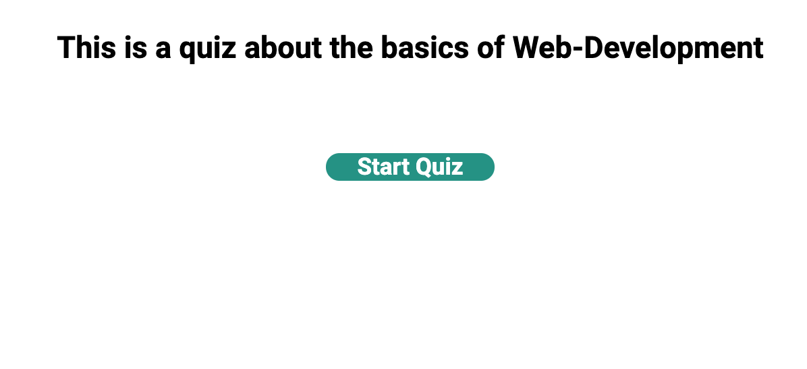
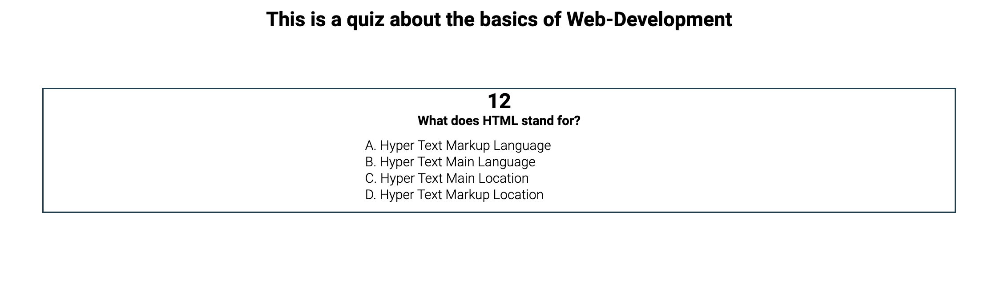
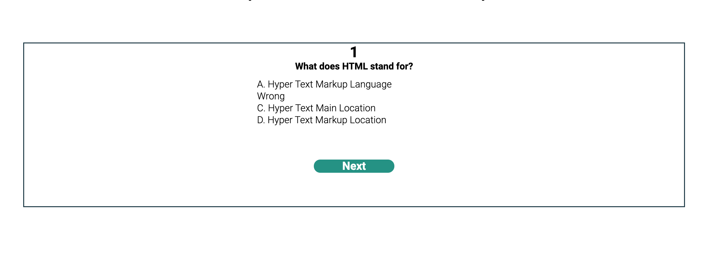
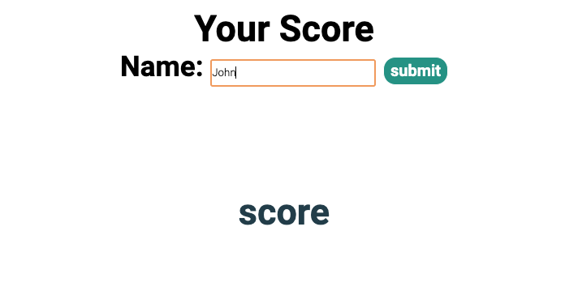
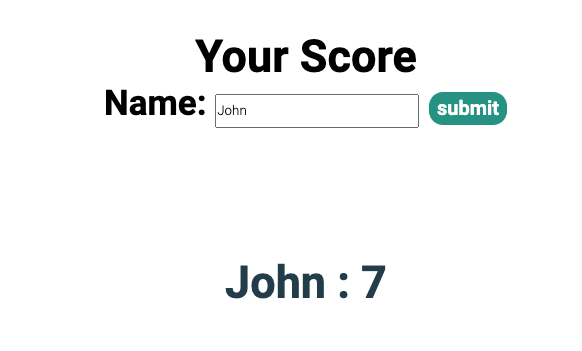

# Web-dev-quiz Project

## Description 
The Web Dev Quiz project is a simple 5 question quiz web app.
Its timed and your score is recorded.
After the quiz is finished you will be taken to a score page where you will input your name and your score will show up right next to it
    **Note:** You can add as much questions as you want but I have 5 so far.

### Before you begin the quiz

### Questions 

### Correct answer

### Wrong answer

### score page

### score page pupulated

 

